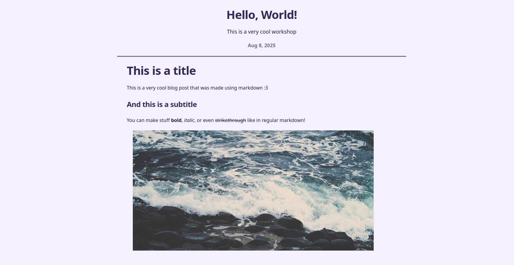
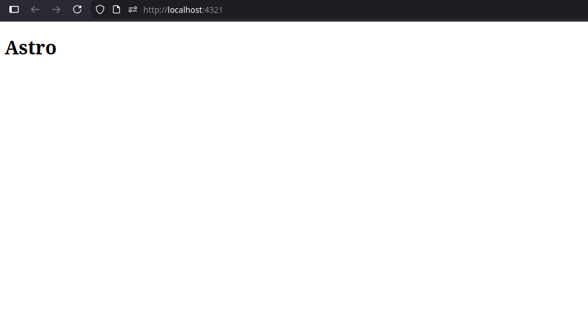
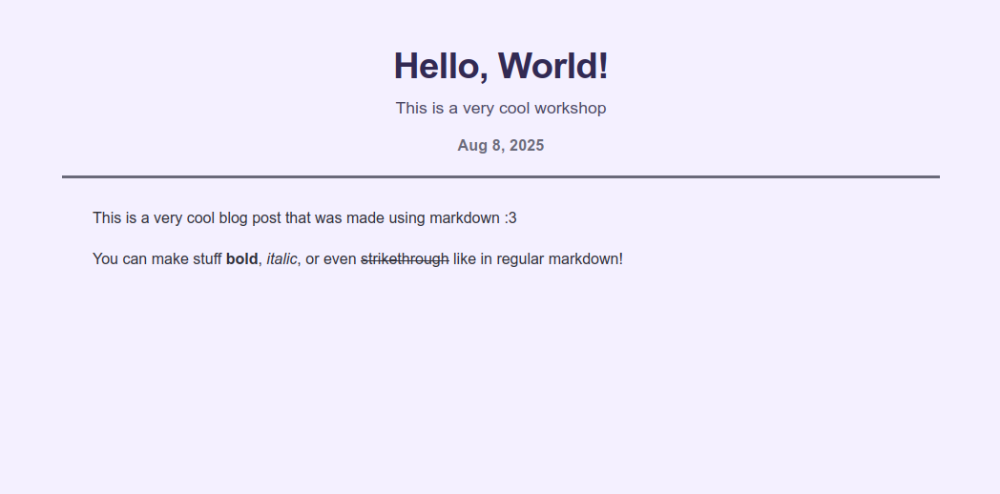
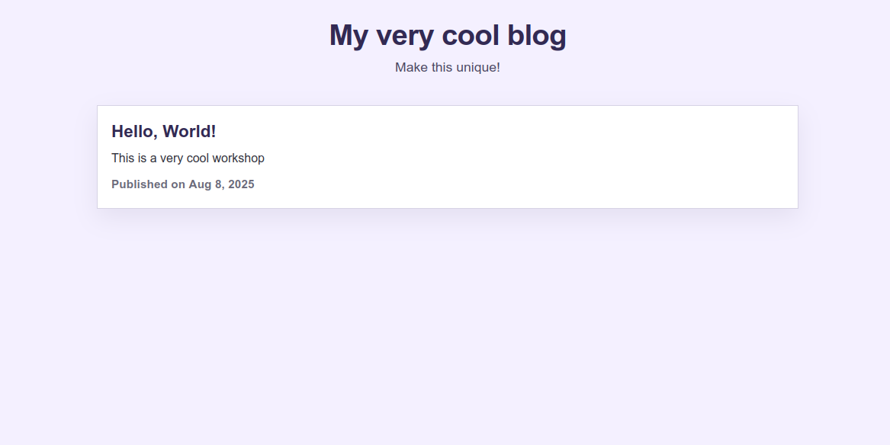
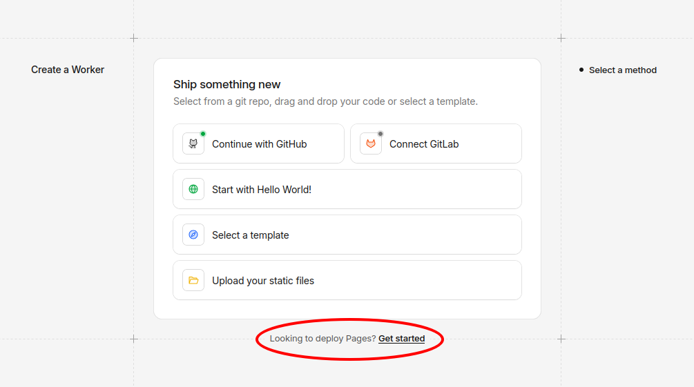
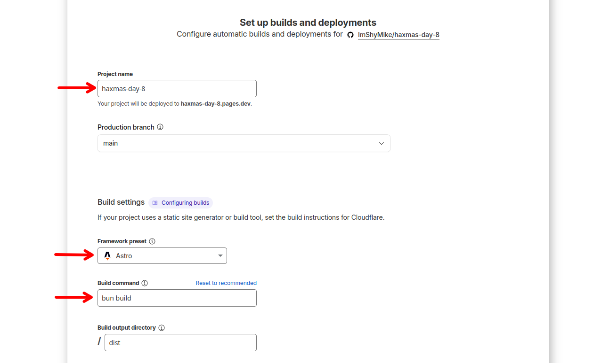
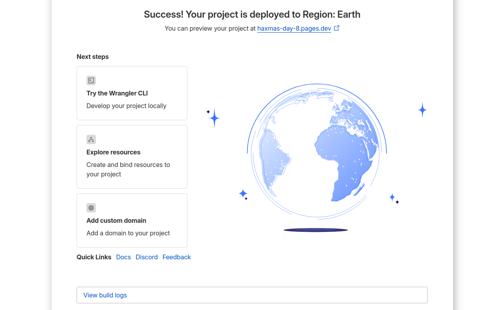

# Let's make a blog with Astro and Markdown!

This workshop will _hopefully_ tech you how to make a simple blog using [Astro](https://astro.build) in about 2 to 3 hours :3

The example project for this workshop can be found here: [https://haxmas-day-11.shymike.dev](https://haxmas-day-11.shymike.dev)
If you have any questions, feel free to ask DM me ([@miggy](https://hackclub.enterprise.slack.com/team/U07VC9705D4)) on Slack!

Have fun!

| Prizes         |
|----------------|
|10$ domain grant|
|1 snowflake     |



---

## Prerequisites

Before starting this workshop, make sure you have the following installed on your machine:

- [Bun](https://bun.sh) ([npm](https://www.npmjs.com/package/npm) also works but I will be using Bun)
- A [GitHub](https://github.com) account
- A [Cloudflare](https://cloudflare.com) account
- An IDE (I will be using [VSCode](https://code.visualstudio.com))

## 1) Create a new Astro project

To start, set up a new Astro project by running the following command in your terminal:

```bash
bun create astro@latest -- --template minimal
```

Give your project a name (e.g., `haxmas-day-11`) and navigate into the project directory:

```bash
cd haxmas-day-11
```

Woah! That was easy!

Now to start the development server, run:

```bash
bun dev
```

You should now be able to head over to `http://localhost:4321` and see your new Astro project running!



## 2) Installing dependencies

No extra dependencies are required but if you are familiar with [tailwindcss](https://tailwindcss.com), you can install it by running:

```bash
bun astro add tailwind
```

## 3) The structure

The final structure of the project should look like this:

```src
├── assets
├── components
│   └── FormattedDate.astro
├── content
│   └── posts
├── layouts
│   └── BlogLayout.astro
├── pages
│   ├── posts
│   │   ├── [...slug].astro
│   │   └── index.astro
│   └── index.astro
├── styles
│   ├── global.css
│   └── post.css
└── content.config.ts
```

Don't worry about the contents of each file yet, that will be done later :P

## 4) Configuring content

Astro will need to read and parse our markdown files, for that we will need to configure stuff in `content.config.ts`.

We will be using the `./src/content/posts` directory to store our blog posts.

```ts
import { defineCollection, z } from 'astro:content';
import { glob } from 'astro/loaders';

const blog = defineCollection({
    // Tell Astro where to look for blog posts
    loader: glob({ base: './src/content/posts', pattern: '**/*.md' }),
    // Schema of the data in each markdown file (using Zod)
    schema: ({ image }) =>
        z.object({
            title: z.string(),
            description: z.string(),
            pubDate: z.coerce.date(),
            heroImage: image().optional(),
        }),
});

// Export the collection
export const collections = { blog };
```

Astro can now read and parse our markdown files! Now let's create some blog posts :3

## 5) Creating blog posts

To create a blog post, create a new markdown file in the `src/content/posts` directory.

I will be using the following markdown file as an example: `hello-world.md`

```md
---
title: Hello, World!
description: This is a very cool workshop
pubDate: Aug 08 2025
heroImage: ../../assets/blog/crazy.jpg
---

This is a very cool blog post that was made using markdown :3

You can make stuff __bold__, *italic*, or even ~~strikethrough~~ like in regular markdown!
```

## 6) Making the homepage

The homepage is defined by the `src/pages/index.astro` file. 

## 7) Displaying blog posts

To display a blog post, we will need to create a layout and a page to render the blog posts.

That's exactly what `BlogLayout.astro` and `posts/[...slug].astro` are for!

The layout file will be used to style and structure the blog post page, while the slug file will be used to match the route to the correct blog post.

- `src/layouts/BlogLayout.astro`:

```astro
---
import { Image } from 'astro:assets';
import type { CollectionEntry } from 'astro:content';

// Import the FormattedDate component
import FormattedDate from '../components/FormattedDate.astro';

// Import CSS styles
import '../styles/global.css';
import '../styles/post.css';

// Get the blog post data from props
type Props = CollectionEntry<'blog'>['data'];
const { title, description, pubDate, heroImage } = Astro.props;
---
<div class="post-page page-shell">
    <article class="post">
        <!-- Header with prost data -->
        <header>
            <h1>{title}</h1>
            <p class="description">{description}</p>
            {heroImage && (
                <Image src={heroImage} format="webp" alt={title} class="hero" />
            )}
            <p class="date">
                <FormattedDate date={pubDate} />
            </p>
        </header>

        <!-- The post's content will be rendered in the slot tag -->
        <div class="body">
            <slot />
        </div>
    </article>
</div>
```

- `src/pages/posts/[...slug].astro`:

```astro
---
import { type CollectionEntry, getCollection, render } from 'astro:content';
import BlogPost from '../../layouts/BlogPost.astro';

// This is used to generate static paths for all blog posts
export async function getStaticPaths() {
    const posts = await getCollection('blog');
    return posts.map((post) => ({
        params: { slug: post.id },
        props: post,
    }));
}

// Get the blog post data from props
type Props = CollectionEntry<'blog'>;
const post = Astro.props;

// Render the markdown content to HTML
const { Content } = await render(post);
---

<BlogPost {...post.data}>
    <Content />
</BlogPost>
```

Oh no! We're missing a `FormattedDate` component!

_Wait, what's even a component? It's reusable piece of code that can be used in many different places on your website._

Let's add it in `src/components/FormattedDate.astro`:

```astro
---
interface Props {
    date: Date;
}

const { date } = Astro.props;
---

<time datetime={date.toISOString()}>
    {
        date.toLocaleDateString('en-us', {
            year: 'numeric',
            month: 'short',
            day: 'numeric',
        })
    }
</time>
```

## 8) It exists?

You can now head over to `http://localhost:4321/posts/hello-world` (or whatever you named your markdown file) to see your blog post live!

_(if you see an error about missing content or incorrect types, stop the dev server and start it again with `bun dev`)_



**The styling is currently very basic and you should tweak it and make it your own before submitting!**

You can see that it's missing a page to list all blog posts. Let's add that next!

## 9) Listing blog posts

The page that will be used to list all blog posts will be `/posts` and the file for that is `src/pages/posts/index.astro`.

It will fetch all blog posts from the content collection and display them in a list.

```astro
---
import { getCollection } from 'astro:content';
import FormattedDate from '../../components/FormattedDate.astro';

// Import CSS styles
import '../../styles/global.css';

// Sort posts by publication date, most recent first
const posts = (await getCollection('blog')).sort(
    (a, b) => b.data.pubDate.valueOf() - a.data.pubDate.valueOf()
);
---

<div class="posts-page page-shell">
    <!-- Text above list of posts -->
    <header class="page-header">
        <h1>My very cool blog</h1>
        <p class="tagline">Make this unique!</p>
    </header>

    {posts.length === 0 && <p class="empty">No posts yet :(</p>}

    <!-- Container with the list of blog posts -->
    <div class="posts">
        {posts.map((post) => (
            <article class="post-card">
                <a href={`/posts/${post.id}`} class="title-link">
                    {post.data.title}
                </a>
                <p class="description">{post.data.description}</p>
                <p class="meta">
                    Published on <FormattedDate date={post.data.pubDate} />
                </p>
            </article>
        ))}
    </div>
</div>
```

You can now head over to `http://localhost:4321/posts` to see all your blog posts!



## 10) Styling

You may have noticed that everything looks horible and that there's no CSS. Well, now it's the time to change that :3

If you want a starting point for styling, you can use the CSS files in [this folder](https://github.com/ImShyMike/haxmas-day-11/tree/main/haxmas-day-11/src/styles).

**Before submitting, make sure to customize the home page and the blog's styles to make it your own!**

Need help with Astro? Check out the [Astro documentation](https://docs.astro.build)!

Want to implement more features into your blog? Check out [Astro's official blog guide](https://docs.astro.build/en/tutorial/0-introduction)!

## 11) Deploying to Cloudflare Pages

To deploy your very amazing blog to Cloudflare Pages:

- Go to the [Cloudflare Pages](https://pages.cloudflare.com) website and log in to your Cloudflare account.

- Click on `Create Application`, then click the small text on the bottom saying `Looking to deploy Pages? Get started`.



- After that, select `Import an existing Git repository` and add your GitHub account.

- Find your project's repository, select it and hit `Begin setup`.

- Edit the following settings:
  - **Project name**: Your project name
  - **Framework preset**: `Astro`
  - **Build command**: `bun build`



- Click `Save and Deploy`.

You're done! After a few seconds, your blog should be live on Cloudflare Pages!



## 12) Submitting

### [https://forms.hackclub.com/haxmas-day-11](https://forms.hackclub.com/haxmas-day-11)
